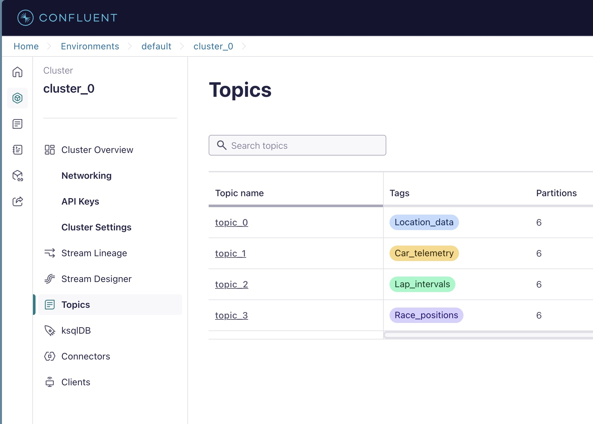
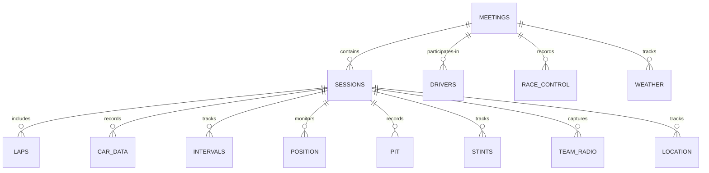
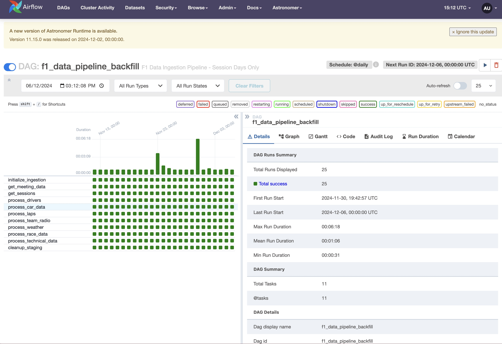
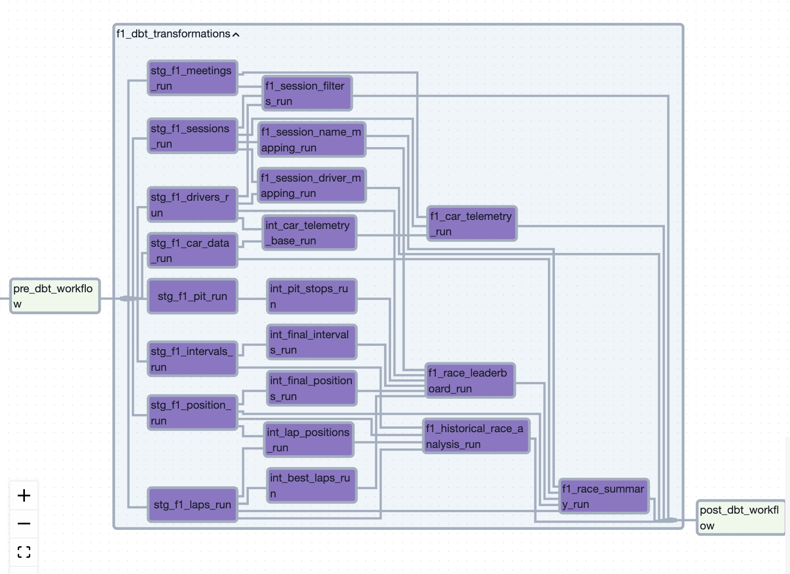
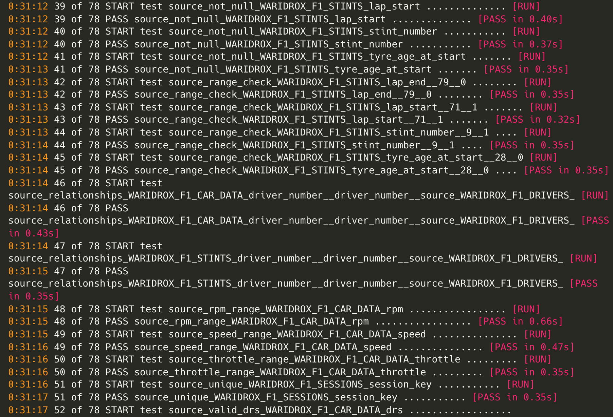

# 🏎️  F1 Insights: Real-Time Replay & Historical Analytics 🏁

## Project Overview

A real-time Formula 1 telemetry system and historical data analysis system that captures, processes, and visualizes car data during race sessions, enabling both live replay and historical analysis.

The project involves two main components:

- **Real-Time Race Replay** - Replay and analyze race events in real-time, diving deep into how and why outcomes occurred
- **Historical Analysis** - Post-race analysis of weather impacts, tire choices, and race/pit strategies

### Real-Time Race Replay

 

The system reconstructs race sessions in real-time, providing insights through:

- Driver performance metrics (speed, throttle, brake data)
- DRS usage analysis
- Gear selection patterns
- Position changes and overtaking maneuvers

### Historical Analysis & Strategic Insights

The system enables comprehensive post-race analysis focusing on:

- Weather impact on tire degradation and pit timing
- Pit strategy effectiveness across conditions
- Tire compound performance analysis

## Architecture & Technology Stack

### Real-time Pipeline

- **Confluent Kafka** on AWS EC2 - Handles high-throughput telemetry data streams
- **SingleStore** - Operational database for real-time ingestion and analytics
- **AWS EC2** (t3.micro) - Hosts Flask API for data processing

### Historical Analysis Pipeline

- **DBT** - Data transformation and modeling
- **Snowflake** - Data warehousing
- **Apache Airflow** - ETL orchestration with WAP pattern
- **Grafana** - Interactive dashboards

## Data Model

## Key Features

### Data Ingestion

- **Idempotent Processing** - Ensures data consistency through merge keys
- **Resilient API Handling** - Retries and fallbacks for reliable data collection
- **Efficient Resource Usage** - Compute optimization for non-race days
- **Safe Data Loading** - Staging tables for atomic updates

### Data Transformation

- **Staging Models** - Initial data cleaning and type conversion
- **Intermediate Models** - Complex calculations and aggregations
- **Mart Models** - Business-ready views for dashboards

### Data Validation

Comprehensive testing suite including:
- Range validations
- Relationship checks
- Custom domain-specific tests

## Dashboards

### LAP Analysis

### Telemetry Analysis

### Tire Strategy Analysis

## Technical Decisions

### Grafana Setup
- EC2 deployment for 1s refresh rates (vs. 5s cloud limitation)
- Dual setup: EC2 for real-time, Cloud for historical analysis

### Database Choices
- SingleStore for real-time operations (ms latency, free tier)
- Snowflake for historical analysis (scalable compute/storage)
